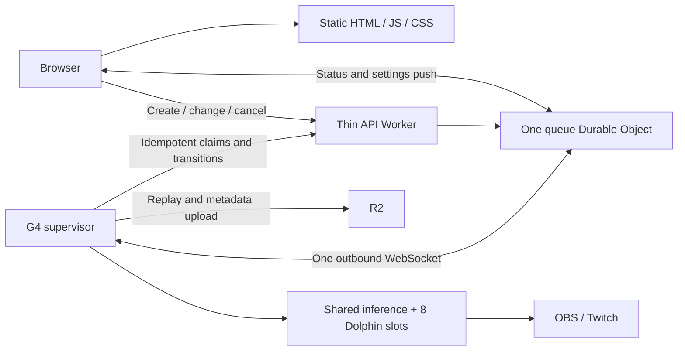

# Proposed free-tier queue architecture — October 2, 2026

Status: design proposal, not implemented or deployed. This does not amend the
canonical spec. The G4 remains shut down. Audit source: commit 64ed8dec.

## Finding

The current queue has separate recurring costs for idle claims, host reports,
active reservation reports, browser status reads, and the stream's queue-depth
read. Replacing only idle claims does not solve the full problem.

Eight occupied slots report every two seconds: approximately 345,600 requests
per day before host reports and browsers. Each fresh report updates observation
state and renews a lease with indexed expiry fields. Index updates count toward
rows written. Browser GETs also update presence at most every ten seconds.
Twenty-eight players can therefore generate 241,920 presence updates per day.

The existing cost tests cover the effect of historical rows. They do not prove
that aggregate daily requests or writes fit eight busy slots.

The current source has no Cloudflare live-settings WebSocket. Plan 2 described
one, but the maintained runtime gets desired state through report responses.
The proposed shared socket must be added. The earlier claim that we could
merely extend an existing socket was incorrect.

## Limits checked

Official documentation was checked on October 2, 2026.

| Resource | Free allowance or platform limit | Proposed operating target |
| --- | --- | --- |
| Dynamic Worker requests | 100,000/account/day | 25,000/day in the workload below; alert before 50,000 |
| Durable Object billable requests | 100,000/account/day | 44,832/day in the workload below; target below 50,000 |
| DO SQLite rows read | 5,000,000/account/day | Below 1,000,000 in the load test |
| DO SQLite rows written | 100,000/account/day | Below 70,000, including indexes, alarms, deletes and accounting |
| DO duration | 13,000 GB-s/account/day | One object; hibernate between events |
| DO stored data | 1 GB/object on Free; 5 GB/account | Live database below 100 MB; monitor all historical objects |
| Worker CPU | 10 ms/request | Validate cold and warm requests; aim below 5 ms p99 |
| Worker/isolate memory | 128 MB | Bounded messages, snapshots and connection count |
| DO CPU | Documentation gives 30 s default per invocation | Short handlers; never use this as the edge Worker's CPU allowance |
| Outgoing connections | 6 per invocation | No replay transfers through the queue; normally one DO call |
| Worker subrequests | 50 external/request; internal-service rules differ | At most a few; no fan-out fetch per viewer |
| DO throughput | About 1,000 requests/s soft limit | Pace reconnects and commands; test 100/s bursts |
| Hibernating WebSockets | Up to 32,768/object, subject to memory/CPU | 100 browsers plus one host |
| WebSocket input | 32 MiB platform maximum | 16 KiB application messages; page larger snapshots |
| SQL | 100 bound parameters; 2 MB row; 100 KB statement | Small bounded queries and batches |
| Worker startup | 1 second | Keep initialization small; no model or asset loading |
| Worker upload | 64 MiB in current limits documentation | Keep model, ISO and emulator outside Workers |
| Static assets | 20,000 files; 25 MiB/file | Existing small web build; assets served directly |
| Workers Logs | 200,000 events/day; 3-day retention | Sample routine messages; target below 20,000/day |

The one-object worst case is 86,400 seconds × 0.128 GB = 11,059.2 GB-s/day,
even if it never hibernates. This leaves little allowance for other active
objects. Old schema-version objects must have no active host sessions or
repeating maintenance loops. Preserve their stored history unless deletion
is separately approved.

These allowances are shared with other applications on the account. No
account-wide analytics or inventory was obtained in this audit. The budget
cannot certify unused capacity elsewhere on the account.

Sources:
- [Workers limits](https://developers.cloudflare.com/workers/platform/limits/)
- [Workers pricing and logs](https://developers.cloudflare.com/workers/platform/pricing/)
- [DO pricing](https://developers.cloudflare.com/durable-objects/platform/pricing/)
- [DO limits](https://developers.cloudflare.com/durable-objects/platform/limits/)
- [DO state and WebSocket APIs](https://developers.cloudflare.com/durable-objects/api/state/)
- [SQL accounting](https://developers.cloudflare.com/durable-objects/api/sqlite-storage-api/)
- [Static asset billing](https://developers.cloudflare.com/workers/static-assets/billing-and-limitations/)

## Architecture

WebSocket upgrades also pass through the thin Worker. It authenticates and
forwards the connection to the object. After upgrade, it does not convert
each message into a new RPC. Both the browser and G4 initiate connections;
the G4 needs no public HAL endpoint.

### Queue and settings

- Keep one coordination object for the shared Slippi account, pairing gate,
  jobs and stream lease. Creating an object per slot would multiply costs
  and complicate the existing single-account invariant.
- Send work-available notifications when work or capacity changes. The host
  issues an idempotent POST claim for an eligible free slot.
- A newly connected host receives an authoritative snapshot and checks once
  for pending work. Wakeups are hints, not durable job assignments.
- Keep all state-changing commands idempotent. Keys include session,
  engine generation where relevant, slot, job, attempt and sequence.
- Persist ownership and transitions before acknowledging them. Never release
  a newer pairing in response to delayed cleanup from an older attempt.
- Push settings changes and cancellations immediately. The host delivers them
  to slot processes over local IPC. The frame loop never waits on Cloudflare.
- On reconnect, replace stale local views from a versioned snapshot and retry
  unacknowledged commands. Do not depend on delivery of every notification.
- No periodic empty claims, browser job GETs, public capacity GETs, or overlay
  queue-depth GETs. Local countdowns use published deadlines.

### Health and failure recovery

- One host health message every ten seconds contains bounded observations
  for all eight slots. It is not eight messages or eight row updates.
- Persist this in one runtime row. Do not index fields that change on every
  heartbeat. Derive liveness from this row and each slot's progress.
- A healthy supervisor must not renew a dead slot. Include slot generation
  and progress sequence; report a stalled slot immediately.
- Retain the 30-second host-silence deadline, 20-second nonplaying job lease,
  60-second playing lease, 60-second initial connection deadline and
  600-second rematch deadline. Tests must cover each boundary.
- A ten-second host report requires changing the current five-second
  capacity-freshness rule. Propose a twenty-second freshness window.
  This is a spec change requiring approval, not an unannounced constant edit.
- Browser application keepalives use the hibernation auto-response API.
  Inspect platform receipt timestamps for presence. Do not write one SQL row
  per browser heartbeat. Persist disconnect deadlines when needed and test
  hibernation, abrupt connection loss and reconnect against the existing
  120-second presence contract.
- Schedule only the next real deadline. Keep an existing earlier alarm,
  process due deadlines in a bounded batch, then schedule the next one.
  Avoid periodic JavaScript timers inside the object.
- Use acceptWebSocket and its hibernation handlers. Close superseded sockets,
  cap buffered output, and disconnect slow consumers with a recoverable
  resync requirement.
- Keep key material and connect codes out of public viewer broadcasts.
  A player may receive its own connection instructions; the stream overlay
  still must not contain a connect code.

### Persistent data and diagnostics

- Write actual transitions, game results, settings revisions and replay
  references. Heartbeats do not append history events or duplicate game lists.
- Bound SQL reads by live jobs: eight assigned and the existing twenty queued.
  Compute a shared public snapshot once, then broadcast it. Do not recompute
  queue position with a separate database scan for every viewer.
- Keep bounded reconnect snapshots and paginate history. The previous
  history-independent query improvements remain necessary.
- Retain the existing event-retention contract. Long-lived job/game tables
  need a reviewed archive/retention policy before they approach the database
  storage threshold. This proposal does not silently delete any history.
- Keep per-frame measurements, value-head updates, video and controller input
  on G4. Cloudflare receives only control and coarse health information.
- Keep a Worker-local maintenance response path that can reject new admissions
  without calling the Durable Object. It still consumes Worker requests.

## Explicit workload and request calculation

Proposed supported workload:
- One host, eight occupied slots and twenty queued players.
- Up to 100 browser connections, including players and read-only viewers.
- At most 10,000 connection/upgrade attempts per day, including reconnects.
- At most 10,000 HTTP control commands per day, including retries.
- 5,000 other dynamic HTTP requests per day reserved for options/bootstrap,
  admin operations, refused requests and diagnostics.
- 5,000 alarm invocations per day reserved for actual deadlines and cleanup.

All figures are design allowances, not measured production traffic.
There is no assumed limit on how many static files the CDN can serve.

| Work | Daily quantity | DO billable requests |
| --- | ---: | ---: |
| Host messages, every 10 s | 8,640 | 432 |
| 100 browser keepalives, every 30 s | 288,000 | 14,400 |
| Connections and reconnects | 10,000 | 10,000 |
| HTTP state changes and retries | 10,000 | 10,000 |
| Other dynamic HTTP, conservatively all reaching DO | 5,000 | 5,000 |
| Deadline alarms | 5,000 | 5,000 |
| **Total** | | **44,832** |

Worker requests: 10,000 + 10,000 + 5,000 = **25,000/day**.
Established WebSocket messages do not count as Worker requests. Incoming DO
WebSocket messages count at 20:1; outgoing messages are not billed requests.
The calculation conservatively counts auto-response keepalives at 20:1.
Static asset requests bypass dynamic code and are free and unlimited.

The byte payload, SQL cost and CPU cost still matter despite cheaper messages.
A signal-only WebSocket wrapped around the old polling loops would not meet
this design.

## SQL budget and overload behavior

The request arithmetic above does not prove the write budget. The following
are implementation gates, not measurements of code that does not yet exist:

- Host runtime updates: 8,640 base-row updates/day.
- Total recurring writes, including alarms and any presence bookkeeping:
  at most 20,000/day.
- Commands, idempotency records, secondary indexes, event logs, archive
  cleanup and budget counters: at most 50,000 additional writes/day.
- Total below 70,000 writes and 1,000,000 reads in the supported workload.

Measure actual cursor.rowsRead and cursor.rowsWritten, plus alarm/storage API
operations. Count deletions and secondary indexes. Count steady-state cleanup
after the retention window, not just an empty new database.

Enforce weighted admission budgets based on measured operation costs. Reserve
capacity for already-admitted matches, lease expiry, session shutdown, replay
completion and crash cleanup before accepting another reservation. Coalesce
slider updates and rate-limit mutations; new arrivals must wait or receive a
clear capacity response when the reserve would be consumed.

Rejected HTTP requests still count against the Worker daily limit. A Worker
rate-limit binding is not an exact global accounting mechanism. Application
limits cannot guarantee service against unlimited traffic, deliberate abuse,
or other applications consuming the account's allowance. Edge protection,
reconnect backoff with jitter, a static maintenance page and usage alerts
reduce exposure; a strict unlimited-load guarantee requires a different plan
or deployment constraint. Do not claim that returning 429 makes requests free.

## R2 and unused services

Keep replay and asset transfers directly between G4 and R2. They must not
consume Worker invocations, CPU, request-body buffering or DO storage.

R2 Standard includes 10 GB-month, one million Class A operations and ten
million Class B operations per month. Egress is free. At 2,000 games/day,
two writes per replay (SLP and metadata) imply about 120,000 object writes
per 30 days, before retries. Storage is the issue: at an illustrative
2 MB/replay, that workload adds 4 GB/day. Retaining every replay indefinitely
cannot remain within the free storage allowance.

The owner rejected automatic replay expiration. Preserve that decision.
No lifecycle deletion is proposed. Paid replay storage or a separately
approved archival destination is required as retained data grows.

The queue does not need Workers KV, D1, Cloudflare Queues, Cron, or
Analytics Engine. Do not add KV for heartbeat caching: its free writes are
only 1,000/day. Existing R2, static assets and the DO are sufficient.

[R2 pricing](https://developers.cloudflare.com/r2/pricing/)

## Required proof before relaunch

1. Extend the existing cost tests into a deterministic full-day workload.
   Cover eight busy slots, a full queue, spectators, setting changes,
   rematches, cancellations, failed connects and replay retries.
2. Run the same workload with large historical tables and with retention
   cleanup due. Charge all indexes, alarms and accounting operations.
3. Test lost notifications, duplicate commands, reconnect storms, slow
   browsers, host crashes, frozen slot processes and hibernation recovery.
4. Verify the request/read/write ceilings above. Stop if any exceeds its
   budget; do not reduce correctness or silently extend leases.
5. Profile cold and warm Worker CPU, constructor work and fan-out. Require
   every measured edge invocation to stay below 10 ms, with margin; a p99
   target alone is insufficient. Local Vitest timing is not a production
   CPU guarantee.
6. Check account-wide usage and old DO instances before deployment. Verify
   static files and maintenance pages bypass the dynamic Worker.
7. Update the schema and runner protocol versions for the new contracts.
   Preserve the schema guard and existing no-migration policy. Do not delete
   old production data without approval.
8. Run the repository handoff checks and Worker tests/typecheck before any
   code handoff. Live Cloudflare verification requires the owner's deployment
   authorization; this audit did not deploy or start G4.

## Audit commands and results

- cat AGENTS.md, skill reads, git status --short, git rev-parse --short HEAD,
  rg searches and selected sed/cat reads inspected source, schemas, callers,
  existing tests, generated web configuration and spec contracts.
- Some initial paths did not exist: live_settings.py, jobs.ts and
  test/billing.test.ts. File discovery found reservation.py, store.ts and
  test/costs.test.ts. Those failed reads made no changes.
- Official documentation was retrieved with web open/find/search. Two
  guessed static-assets URLs were unavailable; the official search located
  the current static-assets billing and routing pages.
- npm test -- test/costs.test.ts, in web/netplay-api: **six tests passed**.
  These validate the current historical-row behavior, not the proposed load
  budget or new transport.
- A JavaScript arithmetic worksheet calculated the request counts, host
  writes and worst-case single-object duration above.
- git diff --cached --check passed for this report. No runtime source changed.
  The design report was committed; code hooks had no applicable files.
- Ruff, ty, full pytest, integration tests and Worker typecheck were skipped
  for this read-only code audit and documentation-only proposal.
- No deployment, VM start, load sent to Cloudflare, storage deletion or paid
  plan change occurred.
